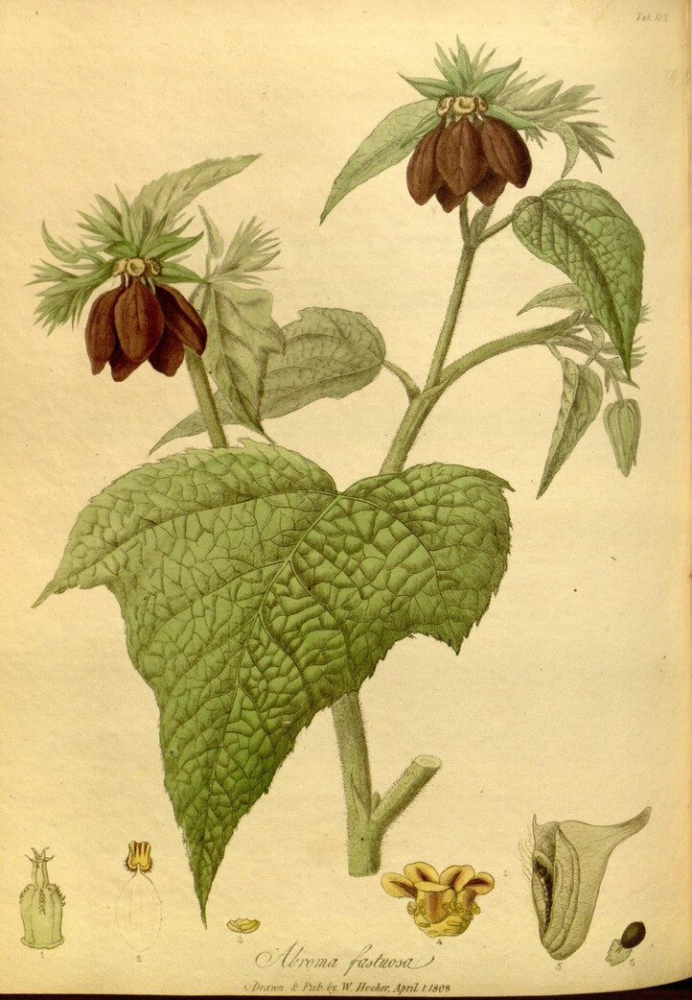

+++++++++++++++++head
.title: Water tolerance test for Abroma augustum
.author: Samiul Joy
.description: This post is about water tolerance capability of the plant Abroma augustum.
.style: ..//css/maind.css
.style: ..//css/main.css
.name-generator: This post is about water tolerance capability of the plant Abroma augustum
.canonical-link: https://samiuljoy.github.io/academics/abromaaugustum.html
-------------------head

++++navigation
.homepage: [home](..//index.html)
.navmenu: roam
.navpage: [demo](..//demo/base.html)
.navpage: [microblog](..//microblog/base.html)
.navpage: [projects](..//projects/base.html)
.navpage: [academics](..//academics/base.html)
.backpage: [base](base.html)
----------navigation

++++++++++++++++main
.ce header2: Water tolerance Experiment

.caption: Abroma augustum (source wikipedia)

 _Abroma augustum_ also known as the devil's breath/devil's plant is a general monsoon plant. Hence, it being a monsoon plant, I thought it would be more tolerable to water logged conditions since there's more possibilities of water logged conditions in monsoon, and the fact that the plant _Abroma augustum_ can mature in rainy season should easily imply that the plant should have better than average tolerability against water logged conditions. Or so I thought.

 I had couple of plants in mind for my thesis project, and _Abroma augustum_ was on my top priority list, since the amount of secondary metabolites in this plant are very rich and important to say the least. I mean, methanolic bark extract even showed apoptosis probabilities in EAC cells which in laments term means, it has possibilities to destroy cancer cells. Read [here](https://pmc.ncbi.nlm.nih.gov/articles/PMC7178513/). It's definitely an important medicinal plant to say the least. However, the approach we took for mass production of the plant includes rapid growth of the plant through Auxin hormone induction which potentially increases secondary metabolite production + morphological growth of the plant. However this procedure requires that the plant should be kept in seedling bags with proper drainage facility. Since it was monsoon season and _Abroma augustum_ was in perfect mature condition, I thought even without less drainage the plants should survive. I thought they were less susceptible to being attacked by atmospheric fungii/fungal spores too since it was their most favorable condition to have maximum yield which means the plants immune system should be at their maximum. Well I was wrong.

After 15 days of planting _Abroma augustum_ in a less drained seed bed, they ended up dying. I planted about 20 replications and 3x3 of them were controls. Well, they all ended up dying. Apparently at 15 days, symptoms were mostly fungal attacks which was the least of our worries. Apparently uprooting the cuttings showed that most of them were unable to even create roots from the cuttings which was very odd despite the fact that _Abroma augustum_ was mostly propagated through cuttings, from which roots were initiated. So that experiment failed.

I then personally re-ran the experiment on our balcony instead of open field and propagated _Abroma augustum_ through both seeds and cuttings. Well they both ended up growing perfectly. However the only change done here was the drainage. Yes, the pots had proper drainage holes in them. I think this was the game changer variable right there.

.hr

----------------main

++++++++++++++++footer
.message: Made with <3 by [samiuljoy](https://github.com/samiuljoy)
.message: [rss](/rss.xml) | [about](/about.html) | [go to top](#)
------------------footer

+++++++script
mode = document.getElementById('switch');

if (! navigator.cookieEnabled) {
	mode.style.display = 'none';
}
else if(! localStorage) {
	mode.style.display = 'none';
}
else {
	mode.style.display = 'inline';
}
-----------------script

+++++++++add
.script: ..//js/toggle.js
-----------add

