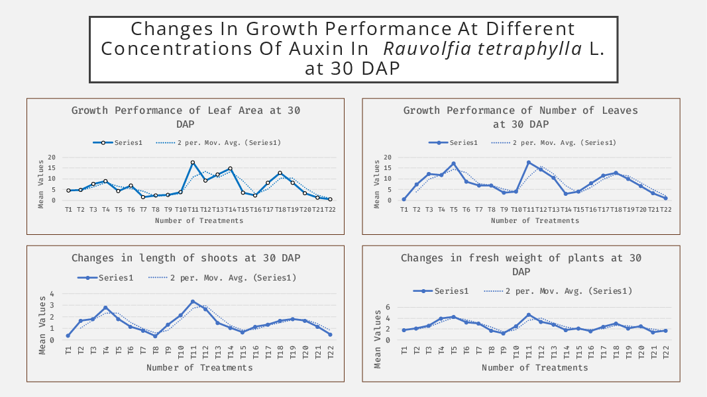
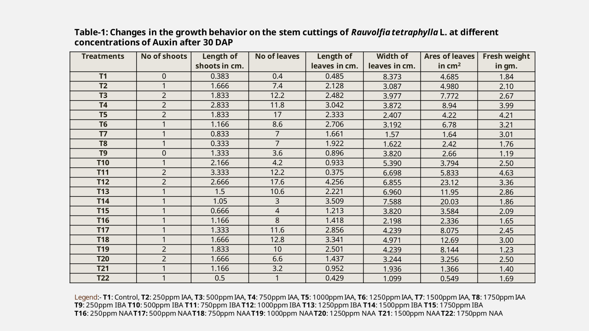
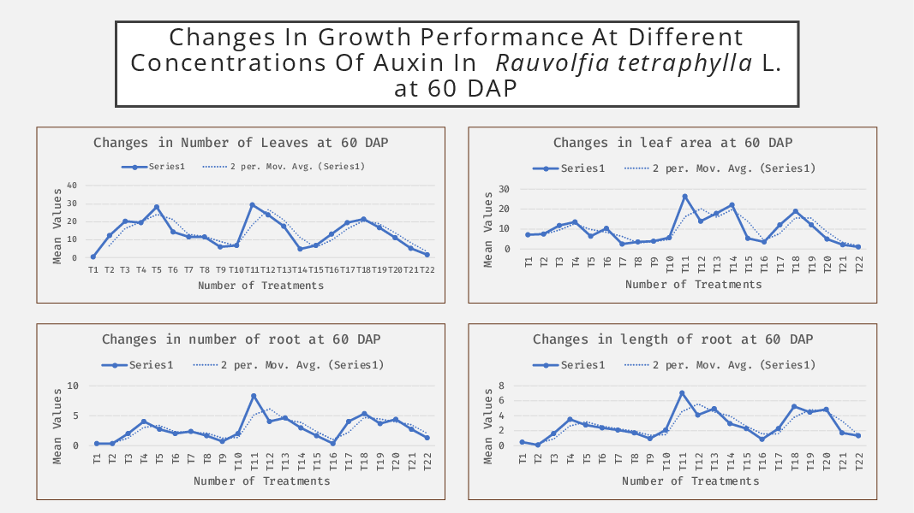
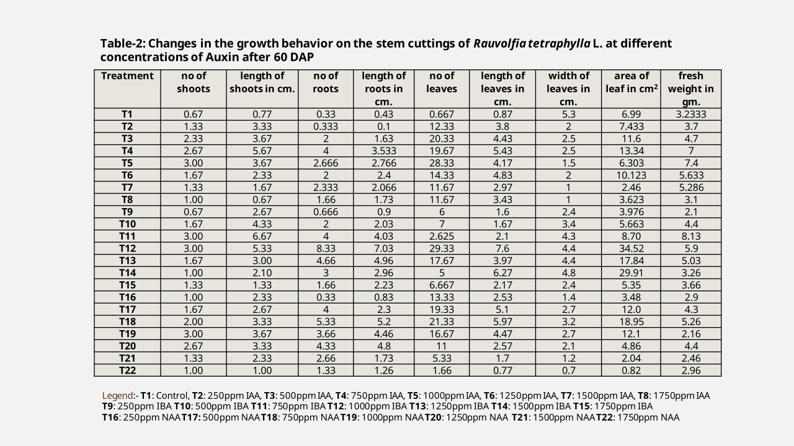
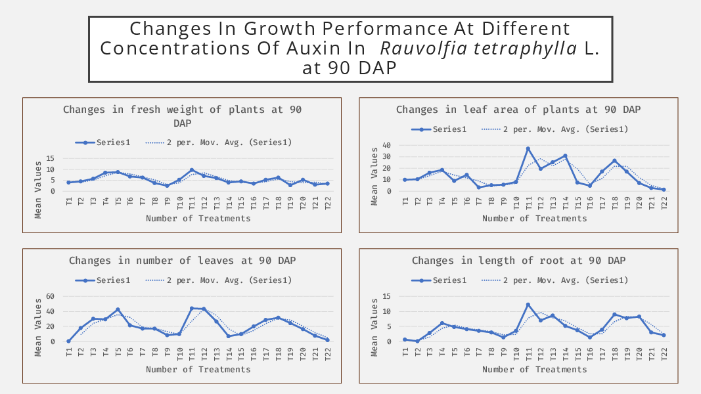
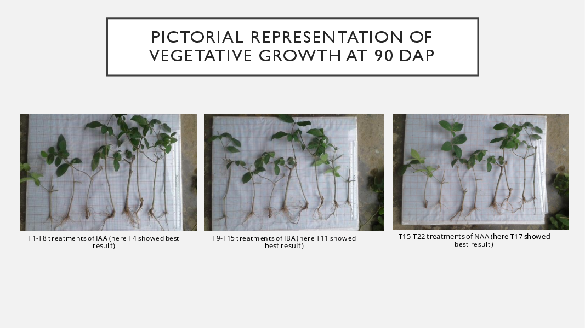
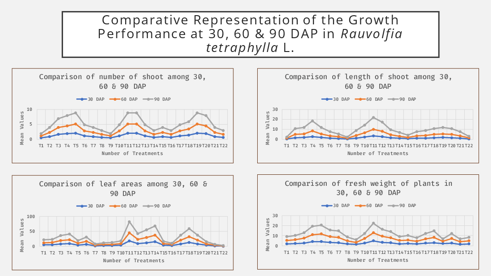
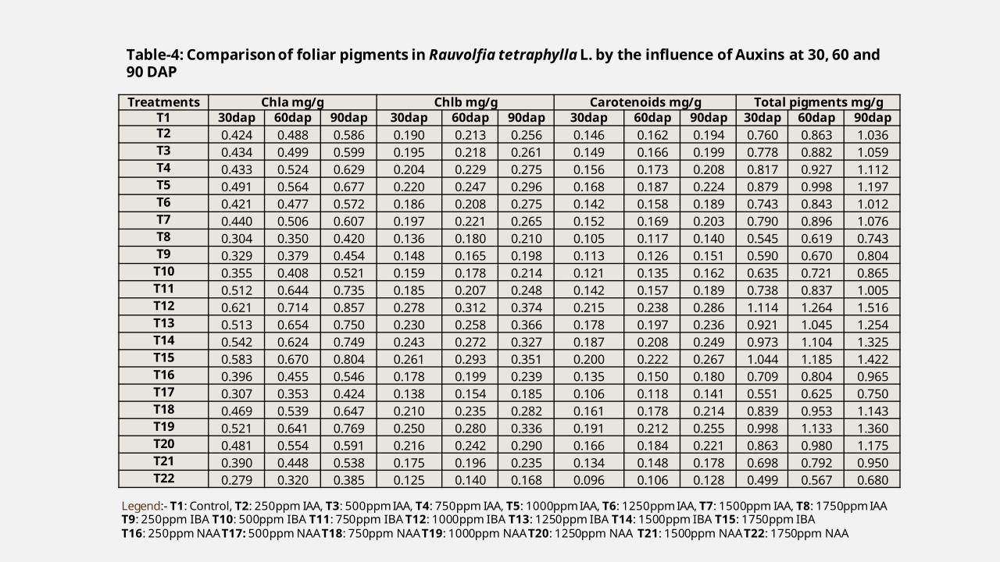
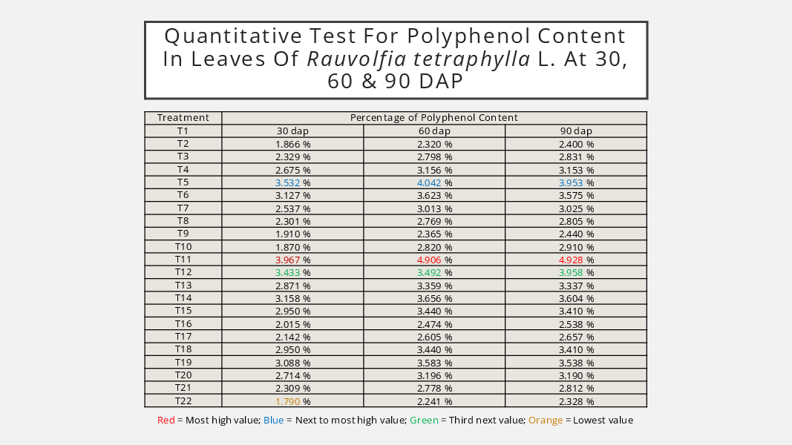

+++++++++++++++++head
.title: Effect of Auxins on growth and biochemical active components in Rauvolfia tetraphylla
.author: Samiul Ahmed Joy
.description: This post discusses about my works the plant Rauvolfia tetraphylla
.style: ..//css/maind.css
.style: ..//css/main.css
.name-generator: This post describes about my works on the plant Rauvolfia tetraphylla
.canonical-link: https://samiuljoy.github.io/academics/thesis.html
-------------------head

++++navigation
.homepage: [home](..//index.html)
.navmenu: roam
.navpage: [demo](..//demo/base.html)
.navpage: [microblog](..//microblog/base.html)
.navpage: [projects](..//projects/base.html)
.navpage: [academics](..//academics/base.html)
.backpage: [base](base.html)
----------navigation

++++++++++++++++main
.ce header2: Study on Rauvolfia tetraphylla

.caption: Rauvolfia tetraphylla [source](https://www.researchgate.net/figure/Rauvolfia-tetraphylla-L-A-Fruiting-branch-B-Inflorescence-C-Calyx-and-pedicel-D_fig1_268367934)

This post gives a general overview of the work I've done on the plant _Rauvolfia tetraphylla_. Basically the premise of this experiment was to determinate best Auxin(IAA, IBA, NAA) concentration for maximum vegetative growth and secondary metabolite production in _Rauvolfia tetraphylla_.

 **Title of Thesis:** Studies on the Effect of Auxins on Stem Cuttings and Bioactive Components in _Rauvolfia tetraphylla_ L.
 **Thesis Lab Name:** Plant Ecology Laboratory - Department of Botany, University of Chittagong
 **Thesis Supervisor:** Mohammed Sala Uddin, Professor - Department of Botany, University of Chittagong

## # Why This Plant

 _Rauvolfia tetraphylla_ is an excellent medicinal plant and is readily available in Chittagong, Bangladesh. It also shows vigorous growth during monsoon season, which was our starting season for thesis work so it was already a huge advantage. I initially intended to use _Abroma augustum_, however, after the previous failed [attempt](abromaaugustum.html) to replicate it from cuttings, I was skeptical of taking further risks. Also, some of the medicinal properties of this plant includes, acting as a vasodilator, basically acting as an antihypertensive drug due to secondary metabolite reserpine, accumulation of vincristine and reserpine has also been reported after salinity stress induction, and vincristine as we know is a huge anticancer agent. Also, _Rauvolfia tetraphylla_ has also shown successful scavenging against harmful radicals in cells, etc. and etc.

## # Why Vegetative Propagation?

So, _Rauvolfia tetraphylla_ produces seeds too however, the rate of success of propagation through seed is quite low. One of the main reasons for poor seed germination is because of the seeds being fleshy, even after maturation, the inside of the seeds still remain semi-liquidish which makes it more susceptible to microbial attacks. Plus, the seeds also need a specific season for growth and development, which could potentially take a very long time depending on the time of plantation. Seed sterility can also be seen due to selfing in _Rauvolfia tetraphylla_ which results in inbreeding depression. So, for a more efficient method of propagation, vegetative propagation is definitely the better choice here.

## # Aim of this Study

* Assessment of vegetative growth under different treatments of Auxins at 30, 60 and 90 DAP.

* Assessment of foliar pigments - Chlorophyll-a, Chlorophyll-b and Carotenoids.

* Assessment of Qualitative test for secondary metabolites at 30, 60 & 90 DAP.

* Determination of Polyphenol content

## # Objective of this Study

* Development of an economical and effective propagation method for the conservation as well as mass cultivation of the plant

* Observing and determining the growth pattern for the maximum overall growth under specific concentrations of Auxin hormone.

## # Overview of Experimental Steps

### - Plant selection

A healthy, disease free _Rauvolfia tetraphylla_ mother plant was selected from the medicinal garden of University of Chittagong.

### - Experimental Site

The location of the experiment was selected to be the Botanical garden of University of Chittagong as it had a suitable climatic condition for the proper growth of _Rauvolfia tetraphylla_

### - Rooting Media

Sandy soil was used as rooting media and a total of 72 polybags were filled with it

### - Experimental Design

CRD (Complete Randomized Design) method was used during the whole experiment

### - Preparing Treatment Solution

Different Concentrations of IAA, IBA and NAA were made. A total of 22 treatments were used with their concentration ranging from 250 ppm, 500 ppm, 750 ppm, 1000 ppm, 1250 ppm, 1500 ppm and 1750 ppm for each concentration.

### - Preparation of Stem Cuttings

Healthy and disease free stems were selected and made sure that they at least had 2-3 nodes on each cuttings. The cuttings were approximately 10-12 cm in length each.

### - Method of Treating the Cuttings

The cuttings were treated using quick dip method. The basal end of the cuttings were dipped in the treatment for 10 seconds and then planted in the rooting medium.

### - Observation and Data Analysis
At 30, 60 & 90 DAP vegetative and foliar data were observed and recorded in different parameters

> **Note:** Graphical data was compiled using Python's Matplotlib Library

## # Observations at 30 DAP

.caption: Overview of vegetative growth after 30 days

.caption: Tabular representation at 30 DAP

.caption: Pictorial Representation at 30 DAP

## # Observation at 60 DAP

.caption: Overview of vegetative growth after 60 days

.caption: Tabular Representation at 60 DAP

.caption: Pictorial Representation at 60 DAP

## # Observation at 90 DAP

.caption: Overview of vegetative growth after 90 DAP

.caption: Tabular Representation at 90 DAP

.caption: Pictorial Representation at 90 DAP

## # Comparative Analysis

.caption: Comparative analysis

.caption: Comparative Tabular Representation

## # Polyphenol Content in Leaves

.caption: Quantitative Polyphenol Content

## # Conclusion/Results

* Maximum number of shoots (3.75) in T11 (IBA at 750 ppm)

* Length of Shoots (11.67 cm) in T11 (IBA at 750 ppm)

* Length of roots (12.308 cm) in T11 (IBA at 750 ppm)

* Maximum fresh weight (8.8 gm) in T5 (IAA at 1000ppm)

* Maximum leaf area (37.028 cm2) in T11 (IBA at 750 ppm)

* Maximum foliar pigments were observed in T11 (IBA at 750 ppm)

* Qualitative phytochemical screening showed positive results

* In quantitative test for polyphenol, highest value was found to be 4.928% in T11 (IBA at 750 ppm)

## # Comment

Hence, the aforementioned concentrations could be considered the most suitable for producing maximum biomass, and the qualitative presence of high number of secondary metabolites indicates the high medicinal value and the presence of quantitative polyphenol shows high anti-oxidant activity in _Rauvolfia tetraphylla_ L.

The ideal concentration for the maximum growth in _Rauvolfia tetraphylla_ L. would be IBA at 750 ppm.

.hr

----------------main

++++++++++++++++footer
.message: Made with <3 by [samiuljoy](https://github.com/samiuljoy)
.message: [rss](/rss.xml) | [about](/about.html) | [go to top](#)
------------------footer

+++++++script
mode = document.getElementById('switch');

if (! navigator.cookieEnabled) {
	mode.style.display = 'none';
}
else if(! localStorage) {
	mode.style.display = 'none';
}
else {
	mode.style.display = 'inline';
}
-----------------script

+++++++++add
.script: ..//js/toggle.js
-----------add

