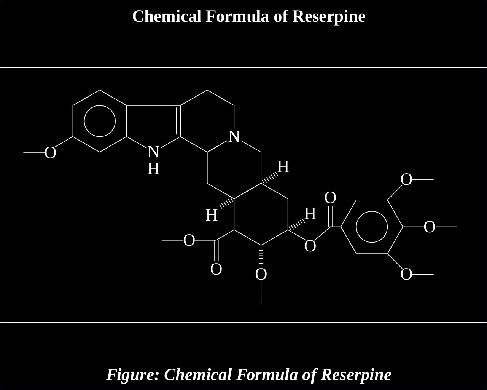

+++++++++++++++++head
.title: Learn the basics of editing groff chemistry documents
.author: samiuljoy
.description: Learn how to edit groff chemistry document files
.style: ..//css/maind.css
.style: ..//css/main.css
.name-generator: Editing groff chemistry documents
.canonical-link: https://samiuljoy.github.io/microblog/gchem.html
-------------------head

++++navigation
.homepage: [home](..//index.html)
.navmenu: roam
.navpage: [demo](..//demo/base.html)
.navpage: [microblog](..//microblog/base.html)
.navpage: [projects](..//projects/base.html)
.navpage: [academics](..//academics/base.html)
.backpage: [base](base.html)
----------navigation

++++++++++++++++main
.ce header1: Groff Chem

Groff is a text formating process for Linux systems. Groff is the Gnu version of roff. Groff is what used to write man pages on Gnu/Linux systems and roff on Unix systems. Chem is an additional extension for drawing chemical structures with groff.

Chemical structures are bounded between .cstart and .cend sections. There's different labels for different structures. There's ring structure, there's Benzene structures so on and so forth.

Below is an image of the structural formula of reserpine made with groff chem;



.caption: Figure: When viewed through a pdf viewer

This is the source code for writing this is groff format;

```1
	.cstart
	R1:	benzene pointing up
		bond -120 from R1.V5 ; O
		bond left
	R2:	flatring5 pointing down double 4,5 with .V2 at R1.V3 with .V3 at R1.V2 put N at 1
		H below R2.V1
	R3:	ring put N at 3 with .V5 at R2.V5
	R4:	ring put N at 1 with .V1 at R3.V3
		back bond -120 from R4.V4 ; H
		back bond 60 from R4.V3 ; H
	R5:	ring with .V1 at R4.V3
		bond -120 
	D1:	double bond down ; O
		bond left from D1.start ; O
		bond left
		back bond 60 from R5.V3 ; H
		back bond down from R5.V4 ; O
		bond down from O
		bond 120 from R5.V3 ; O
		bond 50 from O
	D2:	double bond up ; O
		bond right length .1 from D2.start
	B:	benzene pointing right
		bond 45 from B.V6 ; O
		bond right
		bond right from B.V1 ; O
		bond right
		bond 135 from B.V2 ; O
		bond right
	.cend
```
.code1

__Explanation:__ The R1:, D1:, B: are just labels for different structures. The R1-5 are ring structures from ring 1 to ring 5. R1: is a variable to be exact. You can place any variable in place of R1: or D1: but naming R1 for ring structures or B1 for first bond make things a lot easier to understand.

__R1__

The R1 label has a benzene structure that is pointing up, means position 1 is the top section of the benzene ring. If you've said pointing down, then it'd mean position 1 would start from the bottom top part. R1.V5 means on ring 1 at position 5. So, `bond -120 from R1.V5; O` means make a bond at R1.V5 which is -120 degrees(if you omit the - symbol from -120 then it'd make a bond in the other side) and put O at the end of the bond. Then on the next line we make a bond from O to left side.

__R2__

R2 ring structure starts with a flatring which is 5 sided and is pointing down and has a double bond at position 4 and 5. The `with .V2 at R1.V3 with .V3 at R1.V2` means the bond at position V2 of R2 would make bond with the V3 position with ring1 at position V3 and same for the later part. And at the end, put N at position 1 of R2.

__R3__

Makes a ring and puts N at position 3 with .V5 with R2.V5

Hopefully from this part you can decipher rest of the portion and figure out how it works properly. For further reading see extra documentation stuff in /usr/share/docs/groff and also you can check out the man page for chem syntax with `man chem`.

### Compilation

For compiling this into a pdf use the `-j` flag(preprocessor), so the shell command would look something like this;

```2
	$ groff -mspdf -j filename.chem > file.pdf
```
.code2

.hr

----------------main

++++++++++++++++footer
.message: Made with <3 by [samiuljoy](https://github.com/samiuljoy)
.message: [rss](/rss.xml) | [about](/about.html) | [go to top](#)
------------------footer

+++++++script
mode = document.getElementById('switch');

if (! navigator.cookieEnabled) {
	mode.style.display = 'none';
}
else if(! localStorage) {
	mode.style.display = 'none';
}
else {
	mode.style.display = 'inline';
}
-----------------script

+++++++++add
.script: ..//js/toggle.js
-----------add

