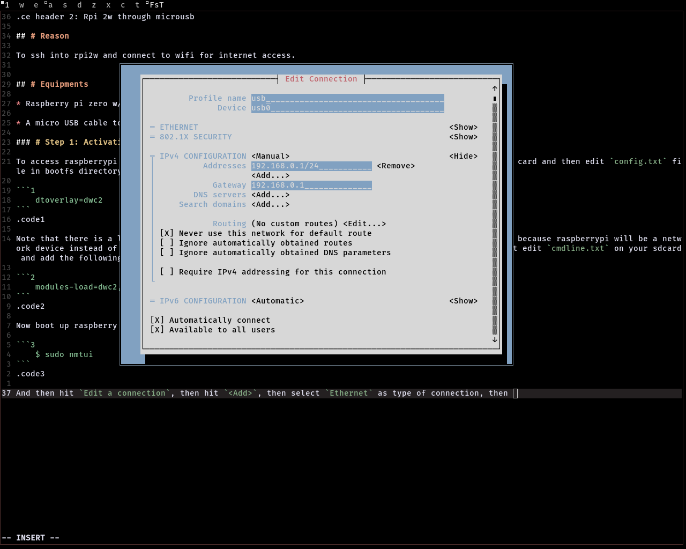

+++++++++++++++++head
.title: Accessing raspberry pi 2w through micro-usb
.author: Samiul Ahmed
.description: A short tut on accessing raspberry pi 2w through micro-usb, that way it becomes easier to access it through ssh on a pc and can connect to wifi at the same time
.style: ..//css/maind.css
.style: ..//css/main.css
.name-generator: Accessing raspberrypi 2w through usb
.canonical-link: https://samiuljoy.github.io/microblog/raspberrypi2ether.html
-------------------head

++++navigation
.homepage: [home](..//index.html)
.navmenu: roam
.navpage: [demo](..//demo/base.html)
.navpage: [microblog](..//microblog/base.html)
.navpage: [theology](..//theology/base.html)
.navpage: [academics](..//academics/base.html)
.backpage: [base](base.html)
----------navigation

++++++++++++++++main
.ce header2: Rpi 2w through microusb

## # Reason

To ssh into rpi2w and connect to wifi for internet access. Mainly using separate interfaces; ssh through usb and internet through wifi, because ssh through wifi adds latency.


## # Equipments

* Raspberry pi zero w/zero 2w (RaspberrypiOS)

* A micro USB cable to power Raspberrypi

## # Procedure

To access raspberrypi through usb cable, usb interface needs to be activated. For that take out your sd card and then edit `config.txt` file in bootfs directory. Add the following line in `config.txt`


```1
	dtoverlay=dwc2
```
.code1


Note that there is a line that says `otg_mode=1` or something similar to that, just uncomment that line because raspberrypi will be a network device instead of a usb device. Now, also make sure to load the dwc2 module at startup. So, for that edit `cmdline.txt` on your sdcard and add the following portion right after rootwait;


```2
	modules-load=dwc2,g_ether 
```
.code2


Now boot up raspberry pi, log in and edit network config. Type into your terminal;


```no
	$ sudo nmtui
```


And then hit `Edit a connection`, then hit `<Add>`, then select `Ethernet` as type of connection, then fill up the blank spaces with reference to the image below;



.caption: Image: nmtui overview

 **Note:** Notice that ipv4 is manual and the check box is selected where it says `Never use this as the default route`. The reason for that is so that we can use wifi as default interface for internet access.


The snippet below summarizes the entire procedure pretty much. Remember all of this needs to be done within your raspberry pi as sudo or root.

!
.caption: Video: Walkthrough


Now to access raspberrypi through your pc, just set a static ipv4 address within same subnet as /24 or 255.255.255.0. Notice in the walkthrough video we gave our raspberry pi an ip address of 192.168.0.2, so our pc can have any ip address between 192.168.0.3-192.168.0.253. And then you can easily ssh into your raspberry pi. Not only that, you can also share your computers internet connection to your raspberrypi. You'd just need to uncheck the `Never use this network as default route` in raspberrypi and enable ip forwarding in your pc and write some `iptables` rule. And for normal use, you can easily connect to wifi and access ssh at the same time.

Also, to auto enable usb0 interface at startup on raspberrypi, make sure to add this line in your `/etc/rc.local`;


```3
	# Considering your usb interface name is usb0 and the network profile name is usb;
	nmcli enable usb
```
.code3


.hr

----------------main

++++++++++++++++footer
.message: Made with <3 by [samiuljoy](https://github.com/samiuljoy)
.message: [rss](/rss.xml) | [about](/about.html) | [go to top](#)
------------------footer

+++++++script
mode = document.getElementById('switch');

if (! navigator.cookieEnabled) {
	mode.style.display = 'none';
}
else if(! localStorage) {
	mode.style.display = 'none';
}
else {
	mode.style.display = 'inline';
}
-----------------script

+++++++++add
.script: ..//js/toggle.js
-----------add

