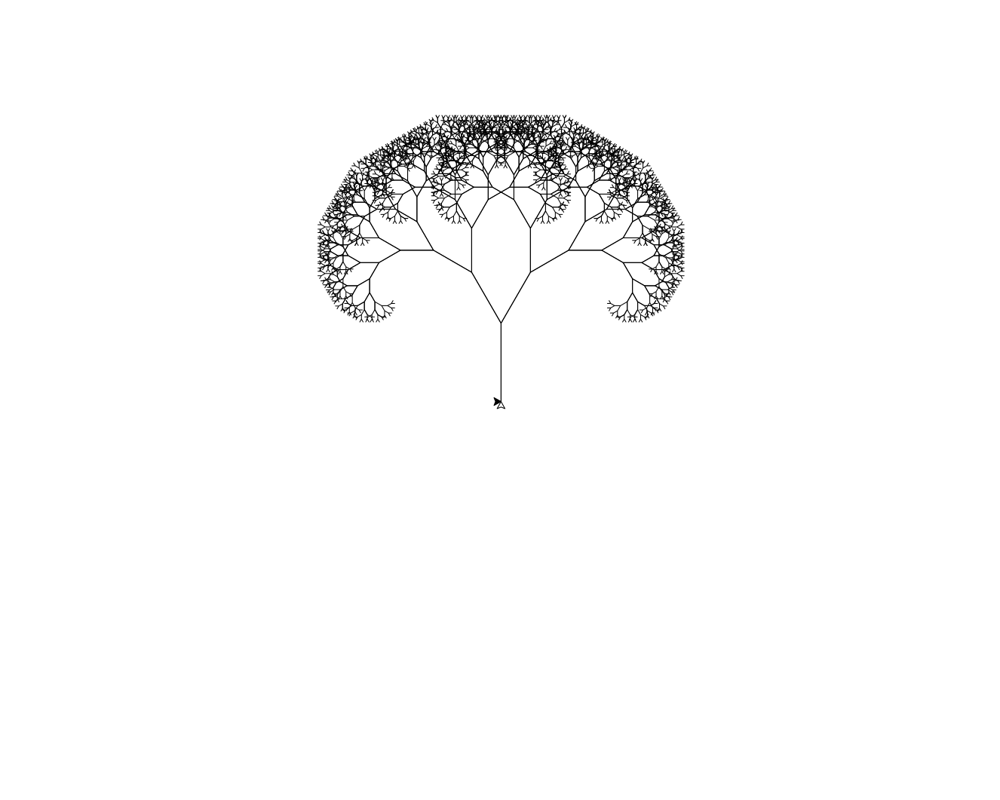

+++++++++++++++++head
.title: Generating a graphical tree with turtle
.author: Samiul Joy
.description: Generate a fractal tree with python module turtle
.style: ..//css/maind.css
.style: ..//css/main.css
.name-generator: turtle fractal tree python
.canonical-link: https://samiuljoy.github.io/microblog/turtle.html
-------------------head

++++navigation
.homepage: [home](..//index.html)
.navmenu: roam
.navpage: [demo](..//demo/base.html)
.navpage: [microblog](..//microblog/base.html)
.navpage: [theology](..//theology/base.html)
.navpage: [academics](..//academics/base.html)
.backpage: [base](base.html)
----------navigation

++++++++++++++++main
.ce header2: Fractal tree



.caption: Fractal Tree

The tree that you saw first on index page was made with turtle. Turtle is a graphical module that comes built in with python programming language. Below is the source code for the tree.

```1
	import turtle
	
	hr = turtle.Turtle()
	hr.color("white", "white")
	
	ts = turtle.getscreen()
	ts.bgcolor("black")
	
	hr.left(90)
	hr.speed(1500)
	
	def tree(i):
	    if i < 4:
	        return
	    else:
	        hr.forward(i)
	        hr.left(30)
	        tree(3 * i/4)
	        hr.right(60)
	        tree(3 * i/4)
	        hr.left(30)
	        hr.backward(i)
	tree(100)
	turtle.done()
```
.code1

I was going through my old notebooks, and found a turtle code in it, then modified it a bit.

.hr

----------------main

++++++++++++++++footer
.message: Made with <3 by [samiuljoy](https://github.com/samiuljoy)
.message: [rss](/rss.xml) | [about](/about.html) | [go to top](#)
------------------footer

+++++++script
mode = document.getElementById('switch');

if (! navigator.cookieEnabled) {
	mode.style.display = 'none';
}
else if(! localStorage) {
	mode.style.display = 'none';
}
else {
	mode.style.display = 'inline';
}
-----------------script

+++++++++add
.script: ..//js/toggle.js
-----------add

