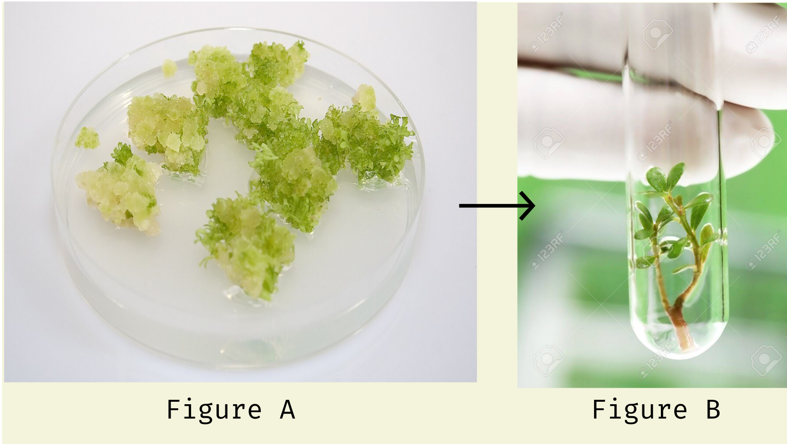

+++++++++++++++++head
.title: Exam on Biology first paper Chapter 11
.author: Samiul Ahmed Joy
.description: Exam on Biology first paper Chapter 11
.style: ..//css/maind.css
.style: ..//css/main.css
-------------------head

++++navigation
.homepage: [home](..//index.html)
.navmenu: roam
.navpage: [demo](..//demo/base.html)
.navpage: [microblog](..//microblog/base.html)
.navpage: [projects](..//projects/base.html)
.navpage: [academics](..//academics/base.html)
.backpage: [base](base.html)
----------navigation

++++++++++++++++main
.ce header2: Plant Biotechnology Creative Q/A

.ce header4: Total Time: 50 Minutes | Total Marks: 30

### # Creative 1

A very important defense protein is found in human body that plays an important role. This protein can be artificially created where a DNA foreign to bacterial chromosome can be used

a. What is PCR?
b. Write 3 main roles of Tissue Culture in Agriculture
c. Describe the process of creating the protein mentioned above
d. "The process mentioned above is more suitable for creating improved varieties compared to hybrid method" - Explain this statement

### # Creative 2

.caption: Tissue Culture Stem Diagram

a. What is a vector?
b. What do you mean by gene cloning?
c. Write the process of generating Image A from Image B
d. In modern times which one is more efficient in terms of culture methods.

### # Creative 3

Using plants totipotent properties, plants now can be artificially cultured in a controlled environment within a short period of time. From this, callus is created from explants and both rootless and rooted plants can be created.

a. What is plasmid?
b. What do you understand by genome sequencing?
c. Write the above steps along with proper labelled diagrams
d. Write down some of the major importance of using this method

.hr

----------------main

++++++++++++++++footer
.message: Made with <3 by [samiuljoy](https://github.com/samiuljoy)
.message: [rss](/rss.xml) | [about](/about.html) | [go to top](#)
------------------footer

+++++++script
mode = document.getElementById('switch');

if (! navigator.cookieEnabled) {
	mode.style.display = 'none';
}
else if(! localStorage) {
	mode.style.display = 'none';
}
else {
	mode.style.display = 'inline';
}

var timeInSecs;
var ticker;

function startTimer(secs) {
	timeInSecs = parseInt(secs);
	ticker = setInterval("tick()", 1000); 
}

function tick( ) {
	var secs = timeInSecs;
	if (secs > 0) {
	timeInSecs--; 
}
else {
	clearInterval(ticker);
	startTimer(50*60); // 4 minutes in seconds
}

var mins = Math.floor(secs/60);
secs %= 60;
var pretty = ( (mins < 10) ? "0" : "" ) + mins + ":" + ( (secs < 10) ? "0" : "" ) + secs;

document.getElementById("countdown").innerHTML = pretty;
}

startTimer(50*60); // 4 minutes in seconds

//Credits to Gulzaib from Pakistan
---------script

+++++++++add
.script: ..//js/toggle.js
-----------add
