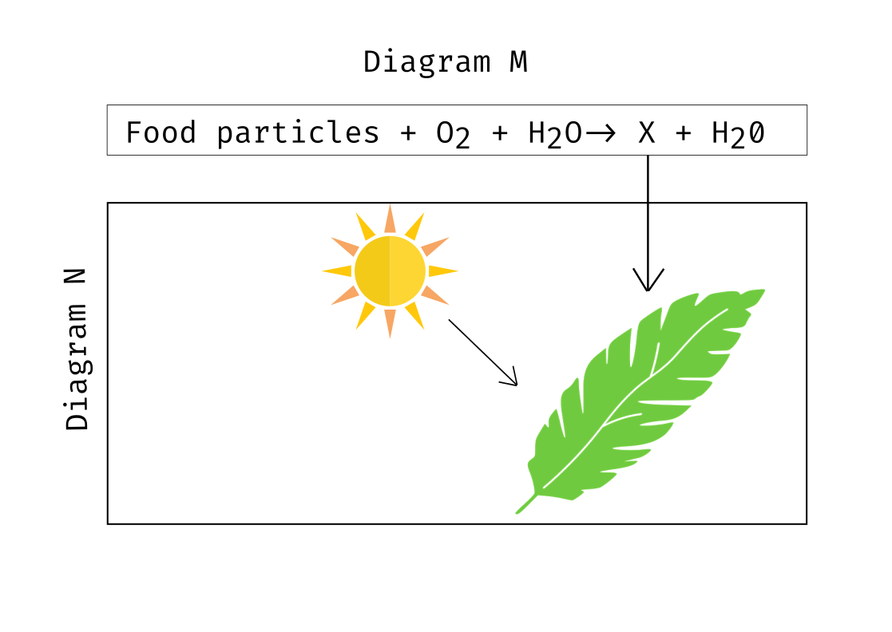

+++++++++++++++++head
.title: Exam on Biology first paper Chapter 9 creative part
.author: Samiul Ahmed Joy
.description: Exam on Biology first paper Chapter 9 creative part
.style: ..//css/maind.css
.style: ..//css/main.css
-------------------head

++++navigation
	
<h4>60</h4>

----------navigation

++++++++++++++++main
.ce header2: Plant Physiology Q/A

.ce header3: [Answer Any 3/7]

.ce header4: Total Time: 60 Minutes | Total Marks: 30

 **Q 1**

A 6-Carbon compound converts into 3-Carbon organic compound through different sequential steps. This 3-carbon organic acid can be oxidized into 2 ways according to organism.

1. Write the full form of NADP
2. What do you understand by oxidative phosphorilation?
3. Write the name of the enzymes used for creating the above mentioned 3-Carbon compound
4. Based on organism, the 3-Carbon compound from above can produce energies of different amount. Explain this statement.

 **Q 2**

.caption: Stomata

1. What do you mean by plasmolysis?
2. What do you mean by symbiosis?
3. The action of 'P' region is controlled by 'Q' - Explain this statement
4. Write the importance of 'P' region in producing food in plants

 **Q 3**

While giving lecture on Plant Biology, the teacher was mentioning to the students about the process of plant water excretion. He basically said that plants can excrete water in mainly 2 ways, one is through evaporation and the other through actual liquid droplets.

1. What do you mean by double fertilization?
2. How does semi-conservative replication take place?
3. Draw a labelled diagram of the above mentioned organ that facilitates a plant to excrete water through evaporation
4. Compare between the 2 organs mentioned in the stem

 **Q 4**

Category A: Sugarcane, Maize
Category B: Mango, Jackfruit

1. What do you understand by limiting factor?
2. Why does mineral salt absorption normally occur through active process/require energy?
3. Write the process of food production of category A plants
4. Write the differences between Category A and Category B plants

 **Q 5 (Q - 15)**

.caption: 2 separate processes

1. What do you mean by plasmolysis?
2. What do you understand by respiration rate?
3. Write the amount of ATP produced in a chart according to the process on Picture M
4. Analyze the process between picture M and N

 **Q 6 (q-32)**

A and B are two pathways in green plants through which Carbon is reduced. It is also evident that, X can not be created from only B pathway without the completion of A pathway. The reaction is as follows;

 X --> 2CH^3^-CO-COOH + 2Y + 2Z (Here Z is a co-enzyme)

1. What do you mean by photorespiration?
2. Prove that water is a must for light phase in photosynthesis
3. Write about the dependence of B on A
4. Write about the process of creation of Z from the stem.

**Q 7 (q - 61)**

Heat dissipation is related to a phenomenon which creates bridge between sunlight and life.

1. What do you understand by inactive absorption?
2. Describe shortly about Donan Equilibrium
3. Why is the process of heat disspiation different in prokaryotic and eukaryotic organism?
4. Both by-product and main-product of photosynthesis plays an important role in conserving environment and maintaining environment equilibrium

Here's the solution these, refer to the question numbers for their respective solution; [solution](https://drive.usercontent.google.com/download?id=1K0Xuqb51xA7IxbU-qGjM9wIXoL_YctNF&export=download)

.hr

----------------main

++++++++++++++++footer
.message: Made with <3 by [samiuljoy](https://github.com/samiuljoy)
.message: [rss](/rss.xml) | [about](/about.html) | [go to top](#)
------------------footer

+++++++script
mode = document.getElementById('switch');

if (! navigator.cookieEnabled) {
	mode.style.display = 'none';
}
else if(! localStorage) {
	mode.style.display = 'none';
}
else {
	mode.style.display = 'inline';
}

var timeInSecs;
var ticker;

function startTimer(secs) {
	timeInSecs = parseInt(secs);
	ticker = setInterval("tick()", 1000); 
}

function tick( ) {
	var secs = timeInSecs;
	if (secs > 0) {
	timeInSecs--; 
}
else {
	clearInterval(ticker);
	startTimer(60*60); // 4 minutes in seconds
}

var mins = Math.floor(secs/60);
secs %= 60;
var pretty = ( (mins < 10) ? "0" : "" ) + mins + ":" + ( (secs < 10) ? "0" : "" ) + secs;

document.getElementById("countdown").innerHTML = pretty;
}

startTimer(60*60); // 4 minutes in seconds

//Credits to Gulzaib from Pakistan
---------script

+++++++++add
.script: ..//js/toggle.js
-----------add
